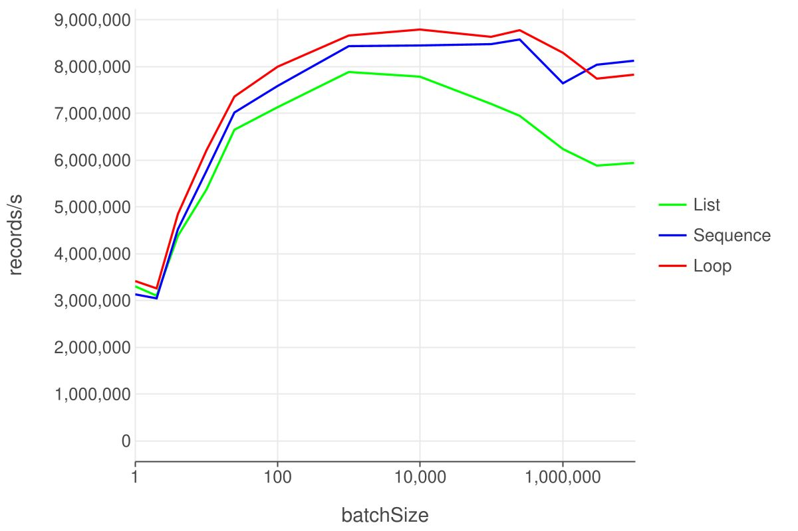

Revenge of the sequence
===

Chris Banes recently wrote an article [Should you use Kotlin Sequences for 
Performance?](https://chrisbanes.me/posts/use-sequence/). It concluded that 
lists are faster than sequences in evey case.

In my opinion that benchmark is flawed: the code measuring the performance of 
sequences starts with creating a list and ends with creating a list. This 
puts it at a disadvantage compared to the code measuring lists, which 
already happens to be in this format.

What do programs actually do?
---

In the real world programs processing records usually have the following 
high-level structure:

read -> deserialize -> process -> serialize -> write

For example a program reads an incoming HTTP request and writes a 
database insert query. Or the other way around, it reads from a database and 
writes an HTTP response.

A better testcase
---

We can implement such a program without the use of intermediate 
lists for output and input. Below is an example using kotlinx-io for input and 
output. It processes a simple record type which can serialize and deserialize 
itself.

```kotlin
fun processRecordsUsingSequence(sourceCsv: Source, destinationCsv: Sink) {
    sequence {
        while (true) {
            val line = sourceCsv.readLine() ?: break
            yield(line)
        }
    }.map {
        Record.fromCsv(it)
    }.filter {
        it.isValid()
    }.map {
        it.update()
    }.forEach {
        it.writeToCsv(destinationCsv)
    }
}
```

The equivalent code using lists is almost identical:

```kotlin
fun processRecordsUsingList(sourceCsv: Source, destinationCsv: Sink) {
    buildList {
        while (true) {
            val line = sourceCsv.readLine() ?: break
            add(line)
        }
    }.map {
        Record.fromCsv(it)
    }.filter {
        it.isValid()
    }.map {
        it.update()
    }.forEach {
        it.writeToCsv(destinationCsv)
    }
}
```

For completeness we also include the code expressed as a single loop. 
This should top the charts in terms of performance:

```kotlin
fun processRecordsUsingLoop(sourceCsv: Source, destinationCsv: Sink) {
    while (true) {
        val line = sourceCsv.readLine() ?: break
        val entity = Record.fromCsv(line)
        if (entity.isValid()) {
            continue
        }
        val newEntity = entity.update()
        newEntity.writeToCsv(destinationCsv)
    }
}
```

Benchmark results
---



Sequences are faster than lists, at ~any size. The difference in throughput is 
small, but keep in mind that sequences also have a huge advantage in memory footprint.

### Links

* Full code: [src/main/kotlin](https://github.com/Erikvv/sequence-revenge/tree/main/src/main/kotlin)
* Repost on [/r/kotlin](https://www.reddit.com/r/Kotlin/comments/1iwi0th/revenge_of_the_sequence/)

### Looking for work?

Consider applying at 
[Zenmo as a developer](https://zenmo.com/vacatures/vacature-backend-developer/)
